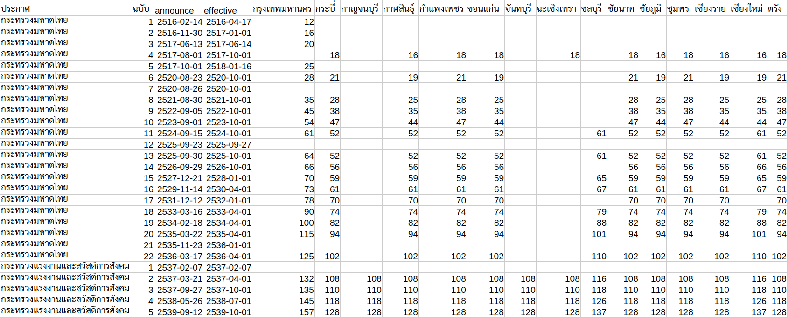
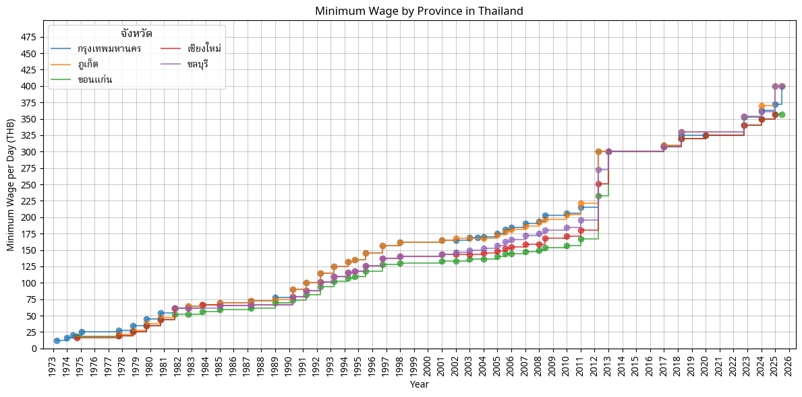

# Thailand Minimum Wage Dataset
Thailand minimum daily wage dataset, as sourced from the official
[Thailand Ministry of Labour website.](https://www.mol.go.th/%E0%B8%AD%E0%B8%B1%E0%B8%95%E0%B8%A3%E0%B8%B2%E0%B8%84%E0%B9%88%E0%B8%B2%E0%B8%88%E0%B9%89%E0%B8%B2%E0%B8%87%E0%B8%82%E0%B8%B1%E0%B9%89%E0%B8%99%E0%B8%95%E0%B9%88%E0%B8%B3)

I've transcribed the data (Excel / PDF) into a more machine-usable format out of curiousity.

This data should allow for easier analysis for whatever you are interested in.

### Usage

- The data is provided in CSV format
- Column 1 & 2 are the source of announcement & announcement number (based on MoL Excel file below)
- Column 3 `announce` is the announcement date in ISO format string, with Thai Buddhist era calendar
- Column 4 `effective` is the announcement date in ISO format string, with Thai Buddhist era calendar
- The remaining columns are Thai province names in Thai (e.g. `กรุงเทพมหานคร,กระบี่,กาญจนบุรี...`) sorted in alphabetical order
- Each cell entry contains the new effective minimum wage for each province (column), in that announcement (row)
- If an announcement does not change the minimum wage for a province, the entry will be left empty

### Important Note
This dataset only captures the minimum wage of each provinces.
More complex cases like these are not properly captured:
- Minimum wage change by Amphoe / District
    - In cases where certain Amphoe has higher minimum wage than the rest of the province, I will use the _lower minimum wage value_ to represent that province
- Minimum wage change by industry / profession
    - I ignore changes by specific industry / professions entirely

Specifically, this includes the latest two changes, which targets specific Amphoe and professions:
- [Jan 1 2025 change](https://www.mol.go.th/wp-content/uploads/sites/2/2024/12/%E0%B8%9B%E0%B8%A3%E0%B8%B0%E0%B8%81%E0%B8%B2%E0%B8%A8%E0%B8%84%E0%B9%88%E0%B8%B2%E0%B8%88%E0%B9%89%E0%B8%B2%E0%B8%87%E0%B8%82%E0%B8%B1%E0%B9%89%E0%B8%99%E0%B8%95%E0%B9%88%E0%B8%B3-%E0%B8%8913%E0%B8%A3%E0%B8%B2%E0%B8%8A%E0%B8%81%E0%B8%B4%E0%B8%88%E0%B8%88%E0%B8%B2.pdf)
- [July 1st 2025 change](https://www.mol.go.th/wp-content/uploads/sites/2/2025/07/%E0%B8%9B%E0%B8%A3%E0%B8%B0%E0%B8%81%E0%B8%B2%E0%B8%A8-%E0%B8%84%E0%B8%88.%E0%B8%82%E0%B8%B1%E0%B9%89%E0%B8%99%E0%B8%95%E0%B9%88%E0%B8%B3-%E0%B8%8914-%E0%B8%A3%E0%B8%A7%E0%B8%A1.pdf)

Older announcements (specifically those made by กระทรวงมหาดไทย) are sometimes ambiguous.
I am unable to find the original documents to clarify changes, so I made assumptions about the intended minimum wage changes;
there may be misinterpretations on my part.

### Data Source

This dataset is transcribed from these files specifically:

- [ตารางแสดงอัตราค่าจ้างขั้นต่ำและการบังคับใช้ (ตั้งแต่ พ.ศ. 2516 - 2561)](https://www.mol.go.th/wp-content/uploads/sites/2/2022/09/TableWage2016-now_for1Oct2022.xlsx)
- [ประกาศคณะกรรมการค่าจ้างเรื่อง อัตราค่าจ้างขั้นต่ำ (ฉบับที่ 12) และคำชี้แจง พร้อมตารางแสดงอัตราค่าจ้างขั้นต่ำ](https://www.mol.go.th/wp-content/uploads/sites/2/2024/01/%E0%B8%9B%E0%B8%A3%E0%B8%B0%E0%B8%81%E0%B8%B2%E0%B8%A8%E0%B8%84%E0%B8%93%E0%B8%B0%E0%B8%81%E0%B8%A3%E0%B8%A3%E0%B8%A1%E0%B8%81%E0%B8%B2%E0%B8%A3%E0%B8%84%E0%B9%88%E0%B8%B2%E0%B8%88%E0%B9%89%E0%B8%B2%E0%B8%87%E0%B8%82%E0%B8%B1%E0%B9%89%E0%B8%99%E0%B8%95%E0%B9%88%E0%B8%B3-%E0%B8%89.12.pdf)
- [ประกาศคณะกรรมการค่าจ้าง เรื่อง อัตราค่าจ้างขั้นต่ำ (ฉบับที่ 13) และคำชี้แจง พร้อมตารางแสดงอัตราค่าจ้างขั้นต่ำ](https://www.mol.go.th/wp-content/uploads/sites/2/2024/12/%E0%B8%9B%E0%B8%A3%E0%B8%B0%E0%B8%81%E0%B8%B2%E0%B8%A8%E0%B8%84%E0%B9%88%E0%B8%B2%E0%B8%88%E0%B9%89%E0%B8%B2%E0%B8%87%E0%B8%82%E0%B8%B1%E0%B9%89%E0%B8%99%E0%B8%95%E0%B9%88%E0%B8%B3-%E0%B8%8913%E0%B8%A3%E0%B8%B2%E0%B8%8A%E0%B8%81%E0%B8%B4%E0%B8%88%E0%B8%88%E0%B8%B2.pdf)
- [ประกาศคณะกรรมการค่าจ้าง เรื่อง อัตราค่าจ้างขั้นต่ำ (ฉบับที่ 14) และคำชี้แจง พร้อมตารางแสดงอัตราค่าจ้างขั้นต่ำ](https://www.mol.go.th/wp-content/uploads/sites/2/2025/07/%E0%B8%9B%E0%B8%A3%E0%B8%B0%E0%B8%81%E0%B8%B2%E0%B8%A8-%E0%B8%84%E0%B8%88.%E0%B8%82%E0%B8%B1%E0%B9%89%E0%B8%99%E0%B8%95%E0%B9%88%E0%B8%B3-%E0%B8%8914-%E0%B8%A3%E0%B8%A7%E0%B8%A1.pdf)

### Contributing
If you notice any errors or if there are new updates to the data feel free to open a pull request.
Please describe any changes, and provide links to the supporting documents where possible. 

